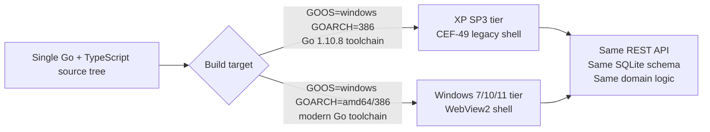

# Windows XP SP3 Compatibility Report

**Status:** Phase 0 deliverable — must be validated on a real/virtual XP SP3 machine before any further implementation phase begins.
**Scope:** Answers the 26 compatibility questions required before writing application code. Every "Recommended" decision below is a starting hypothesis; items marked **⚠ Validate in Phase 0** are the ones most likely to break in practice and must be proven on real hardware/VM, not assumed from documentation.

---

## 0. Executive summary

Windows XP SP3 is a **2001-era, EOL-since-2014** operating system. No actively maintained Go toolchain, browser engine, or installer targets it anymore. Building a "modern premium POS" on it is possible, but only by **freezing specific tool versions at the last release that supported XP** and by **isolating everything that depends on those frozen versions behind interfaces**, so the rest of the system can move forward on modern Windows without being held back.

The practical consequence for the whole project:

> **The Go source code will be written in a conservative dialect (pre-generics, minimal modern stdlib) so the same source tree compiles with both an old XP-capable Go toolchain and a modern Go toolchain.** Platform/hardware specifics are isolated behind Go interfaces and build tags. The frontend is one React/TypeScript source tree compiled twice: once to a modern JS bundle (WebView2 tier) and once to a heavily transpiled/polyfilled bundle (legacy CEF/XP tier), with animation and CSS-feature usage gated by capability flags, not by browser-sniffing hacks.

This is a **two-tier target model**, not a compromise on the "one codebase" requirement — the codebase stays one, the build/runtime tier is selected at compile/package time.

---

## 1. What exact Go version will be used?

**Go 1.10.8** (the final patch release of the 1.10 branch) for the **XP build**.
**Go 1.22.x (latest stable at implementation time)** for the **modern Windows build**.

## 2. Why does it support Windows XP?

Go's toolchain team publicly documented that **Go 1.10 is the last release with official Windows XP and Windows Vista support**; Go 1.11 (Aug 2018) raised the minimum to Windows 7. Go 1.10.8 is the last security-patched point release on that branch. This is a hard ceiling: no XP-supporting Go release will ever receive newer language features, and the reverse also holds — no post-1.10 Go binary runs on XP because it starts depending on kernel32.dll entry points (e.g. `CreateSymbolicLinkW`, thread/TLS handling changes, `GetQueuedCompletionStatusEx` behavior) that XP's kernel32 doesn't export the way Go 1.11+'s runtime expects. ⚠ **Validate in Phase 0**: confirm the exact 1.10.8 binary boots on a real XP SP3 box (32-bit), not just Vista/Server 2003, since community reports vary on edge cases.

## 3. What Windows architecture will be targeted?

**`windows/386`** (32-bit) as the primary and only fully-supported XP target. Consumer XP SP3 is overwhelmingly 32-bit; XP Professional x64 Edition exists but is actually built on the Windows Server 2003 SP1 kernel and is rare in the field — not worth the extra QA burden. The modern-Windows build targets `windows/amd64` (with a `windows/386` fallback build for old 32-bit Windows 7/8 machines if ever needed).

## 4. Can one codebase support XP and newer Windows?

**Yes, with discipline, not automatically.** Concretely:

- No generics, no `any` alias, no `go:embed`, no `errors.Is/As`/wrapping (`%w`), no `io/fs`, no `strings.Cut`, no post-1.10 stdlib additions **in shared domain code**.
- Use **GOPATH + vendoring**, not Go modules, for the parts that must compile under 1.10 (modules require Go 1.11+). The modern build can still consume the same vendored source tree; Go 1.22 tolerates a GOPATH-vendored layout fine, or a thin `go.mod` can wrap the same source for the modern build only (build-tag-excluded from the XP toolchain's view).
- Every dependency (SQLite driver, `x/sys/windows`, HTTP router, etc.) must be **pinned to a commit that predates its own move to modules or to newer-Go-only syntax**.
- Hardware/platform code (printer spooler calls, drawer pulses, embed-vs-external asset loading) lives behind Go **interfaces** in `internal/hardware`, `internal/printing`, `internal/assets`, with two implementations selected by **build tags** (`//go:build xp` vs default), not by runtime `if` branches guessing OS version.

This satisfies the requirement in spirit: one domain/business-logic codebase, two compiled artifacts.

## 5. What SQLite driver will be used?

**`mattn/go-sqlite3`**, pinned to a version from ~2018 (contemporary with Go 1.10, e.g. tag `v1.9.0`–`v1.10.0` era) for the XP build; a current `mattn/go-sqlite3` release for the modern build.

Pure-Go alternatives (`modernc.org/sqlite`) were explicitly evaluated and **rejected for the XP tier**: `modernc.org/sqlite` is transpiled C-to-Go (via `ccgo`) and its releases have tracked recent Go versions for years — no maintained release compiles under Go 1.10. It remains a good option for the modern-Windows-only build path in the future if the project ever wants to drop CGO there, but that is out of scope now to avoid two divergent SQLite access layers.

## 6. Does that SQLite driver work under the selected Go/Windows target?

`mattn/go-sqlite3` is CGO-based and links a bundled SQLite amalgamation compiled as C. It has historically shipped `windows/386` and `windows/amd64` support and worked on Go 1.10-era toolchains — this is the same driver generation the wider Go ecosystem used in 2016-2018 for exactly this kind of desktop app. ⚠ **Validate in Phase 0**: build a trivial CGO binary with Go 1.10.8 + the 32-bit mingw toolchain (below) and confirm it actually opens/reads/writes a `.db` file on a real XP SP3 VM — CGO cross-compilation from a modern Linux host to `windows/386` under an ancient Go version is the single riskiest link in this whole stack.

## 7. Does it require CGO?

**Yes.** `CGO_ENABLED=1` is required for `mattn/go-sqlite3`. This is a deliberate, accepted tradeoff: it removes the possibility of a "just cross-compile with `GOOS=windows go build`" one-liner and requires a real C toolchain, but it is the only SQLite driver with a long, boring track record on old Windows/Go combinations. The interface `internal/storage` wraps all DB access so a future swap to a pure-Go driver (once the XP tier is eventually dropped) touches one package, not the whole app.

## 8. What compiler/toolchain is required?

- **32-bit `mingw-w64` GCC** (a TDM-GCC or standard mingw-w64 `i686` build contemporary with Go 1.10, e.g. GCC 7.x/8.x `i686-w64-mingw32-gcc`) as `CC` when cross-compiling the XP artifact from Linux CI, or a native MinGW install if building on Windows directly.
- Go 1.10.8 itself as `GOROOT`, installed side-by-side with the modern Go toolchain (via `g` / `goenv`-style version managers, or simply two separate `GOROOT` directories selected by the build script) — never as the machine's default `go`.
- The modern build uses whatever current mingw-w64/gcc or MSVC toolchain the CGO SQLite driver needs on `windows/amd64`, entirely independent of the XP toolchain.

## 9. What rendering/browser engine will display the React UI?

Two tiers, chosen because **no currently-maintained browser engine runs on XP**:

| Tier | Engine | Windows target |
|---|---|---|
| Modern | **WebView2** (Chromium/Edge, evergreen or fixed-version runtime) | Windows 7 SP1+ (with the WebView2 Runtime installed) through 11 |
| Legacy | **CEF3 frozen at the Chromium 49 branch** (community-maintained "CEF-XP" builds) | Windows XP SP3 |

Chromium's own upstream support for XP ended at **Chrome 49** (Chrome 50, April 2016, dropped XP/Vista). CEF tracks Chromium branches, so the only way to get a Chromium-class engine on XP today is an **unofficial, community-patched CEF3 build pinned to the Chromium 49 branch point**. This carries real risk: it is not officially maintained, carries known-unpatched Chromium 49 CVEs (acceptable only because XP itself is already unsupported and the POS never browses the open internet), and must be vetted for build provenance before shipping. ⚠ **Validate in Phase 0** — this is the highest-risk item in the entire report; see §"Fallback" below.

**Fallback if CEF-XP proves unshippable:** a native **IE8 `WebBrowser` ActiveX (`mshtml`) control**, which ships in XP SP3 by default and needs zero extra runtime install. This forces a drastically simplified "Legacy Basic UI" (ES3 + CSS 2.1 only, no flexbox/grid, table-based layout) for XP-only machines — still fully functional for sales/cash/print, but visually and interactively a generation behind the WebView2 tier. This fallback must be architected for from day one (see the UI capability-flag approach in §11–15) rather than bolted on later.

## 10. What version of that engine supports Windows XP?

- CEF-XP tier: **Chromium 49** (~V8 4.9, released March 2016) — the last Chromium build line with any XP compatibility, kept alive only by unofficial patches.
- IE8 fallback tier: **Trident/MSHTML as shipped in IE8** (XP SP3's native, non-upgradable ceiling; IE9+ never released for XP).

## 11. What JavaScript level does that runtime support?

- **Chromium 49 (CEF-XP tier):** strong ES2015 support (`let`/`const`, arrow functions, classes, template literals, `Map`/`Set`, `Promise`, `fetch` (added Chrome 42)), **but no native `async`/`await`** (landed Chrome 55/V8 5.5) and **no CSS Grid** (landed Chrome 57). Treat this as "ES2015 baseline, no async/await, no optional chaining/nullish coalescing, no `queueMicrotask`."
- **IE8 fallback tier:** **ES3 only** — no `let`/`const`, no arrow functions, no classes, no template literals, no `Promise`, no `fetch`, no `Array.prototype` ES5 methods without a polyfill (`forEach`/`map`/`filter` actually landed ES5/IE9, so even those need polyfilling), no JSON.parse natively guaranteed pre-IE8 (IE8 does have native JSON, so that one is fine).

## 12. Which frontend syntax must be transpiled?

Single React/TypeScript source, three build outputs from the same `tsconfig`/Babel pipeline with different targets:

1. **WebView2 build:** `target: "es2020"` or newer — effectively no transpilation needed beyond TSX→JS.
2. **CEF-XP build:** `target: "es2015"`, with `@babel/plugin-transform-async-to-generator` (or TypeScript's `downlevelIteration`) since async/await must be regenerator-compiled; no arrow-function/class/const transpilation needed since Chromium 49 has those natively — keep the transform minimal to keep bundle size and CPU parse time down on 1 GHz-class hardware.
3. **IE8 fallback build** (only if CEF-XP is rejected in Phase 0): `target: "es5"`, full Babel preset-env transpilation, no JSX runtime automatic mode (use classic `React.createElement`), and a much smaller component subset (the "Legacy Basic UI").

## 13. Which polyfills are required?

- **CEF-XP tier:** none expected for JS; if any nice-to-have library assumes `queueMicrotask`, `structuredClone`, `ResizeObserver`, or `IntersectionObserver` (all post-Chromium-49), polyfill or avoid those specifically. `fetch`, `Promise`, `Map`/`Set` are native — do not polyfill unnecessarily and bloat the bundle.
- **IE8 fallback tier:** `es5-shim`/`es5-sham`, `whatwg-fetch` (via XHR), `es6-promise`, `classlist.js` (IE8 lacks `element.classList`), a `JSON` polyfill only if targeting pre-IE8 (not needed here). React itself does **not** support IE8 past React 15 — the fallback tier likely means **React 15.x with `es5-shim`**, or dropping React entirely for that tier in favor of hand-written DOM/template code. This must be decided empirically in Phase 0, not assumed.

## 14. Which browser APIs cannot be relied upon?

Across both legacy tiers, avoid or feature-detect: `WebSocket` (present in Chromium 49, **absent** in IE8 — use polling for the IE8 fallback), `localStorage` (present in both, but per §5 of the brief it's disposable-UI-only anyway), Web Audio API (§58 already mandates an abstraction), `navigator.usb`/WebHID/WebSerial (not available in either legacy engine — hardware access must go through the Go backend, never the browser, which the architecture already requires), Service Workers, `IntersectionObserver`, `ResizeObserver`, CSS `backdrop-filter`, native drag-and-drop niceties.

## 15. Which CSS features cannot be relied upon?

- **CEF-XP (Chromium 49):** flexbox — yes; CSS variables (`var()`) — yes (Chrome 49 shipped it); **CSS Grid — no**; `gap` on flexbox — no (Grid/flexbox `gap` came much later); use margins for flex gaps. Keep transitions/transforms simple (2D, avoid heavy `filter`/`backdrop-filter`/expensive box-shadow blurs given the CPU/GPU budget).
- **IE8 fallback:** CSS 2.1 essentially — no flexbox, no border-radius reliability (IE8 needs `-ms-` prefixes that don't exist; border-radius is IE9+), no CSS transitions/animations at all, no `rgba()` opacity without filters. Layout must fall back to floats/tables. This tier should visually read as "plain, functional, 2005-era software" — acceptable because it is the emergency fallback, not the flagship experience.

## 16. How will React be bundled?

**Vite** (or esbuild/webpack, decided in Phase 0 based on which tolerates the ES2015-without-async-await target cleanly) building **two separate output bundles from one `src/` tree**: `dist/modern/` (WebView2) and `dist/legacy/` (CEF-XP), selected by a `VITE_TARGET_TIER` env var at build time. Shared components must not import tier-incompatible browser APIs directly — those go through the `services/` abstraction layer (audio, printing status, etc.) so the same component tree compiles for both tiers; tier-specific behavior (e.g. disable a CSS Grid-based report chart layout on the legacy tier) is controlled by a small `capabilities.ts` runtime flag object rather than `if (isIE)`-style sniffing.

## 17. How will the frontend be launched?

The Go binary starts the **local REST/HTTP server on `127.0.0.1:17831`** first, then launches the platform-appropriate shell window:

- **Modern tier:** a small native Win32 host window hosting the **WebView2** control, pointed at `http://127.0.0.1:17831/` (or at embedded assets served by the Go HTTP server directly — simplest and preferred, avoids a second static file server).
- **Legacy tier:** the CEF-XP (or IE8 `WebBrowser` ActiveX fallback) host window, same URL, same local server. From the cashier's perspective both are indistinguishable native app windows — no address bar, no browser chrome, no window title bar links.

## 18. Can frontend assets be embedded into the executable?

**Only in the modern build.** `go:embed` requires Go 1.16+, so it is unavailable to the Go 1.10.8 XP toolchain by construction (§4). Decision:

- **Modern build:** embed the built `dist/modern/` assets into `pos.exe` via `go:embed`, served straight from memory by `net/http`. Simplest deployment: one `.exe`.
- **XP build:** ship `dist/legacy/` as loose files under `frontend/` next to `pos.exe` (see §90's directory layout) and serve them from disk via `http.FileServer`. This is why the deployment tree in the architecture doc keeps a `frontend/` folder even though the modern build won't need it populated for a WebView2-only install.

## 19. If not, how will they be packaged?

Plain files on disk under `POS/frontend/`, laid down by the installer (§20), read-only-mounted by the Go HTTP server at startup. No zip-in-exe tricks needed — XP's filesystem and antivirus-free assumption make loose files simplest and easiest to hot-patch in the field without rebuilding the Go binary.

## 20. Which installer technology still supports XP?

**NSIS (Nullsoft Scriptable Install System), current 3.x line.** NSIS's own compiler and generated installer stub remain compatible down to very old Windows without special pinning — it is one of the few installer toolchains that never dropped XP. **Inno Setup is explicitly avoided for the XP artifact**: Inno Setup 6 requires Windows 7+ at install time; only the older **Inno Setup 5.6.1** line supports XP, and it is effectively unmaintained. Since the project already needs two build/installer pipelines (XP vs modern), it's simpler to standardize on **NSIS for both** than to maintain NSIS-for-XP and Inno-for-modern side by side. Installer does directory creation, shortcuts, and uninstall registration entirely offline — no internet required, per §93.

## 21. How will raw ESC/POS printing work?

Through a `internal/printing` package exposing the `ReceiptPrinter` interface from §32, with a Windows implementation that talks to the **Windows print spooler in RAW mode**: `OpenPrinter` → `StartDocPrinter` (datatype `"RAW"`) → `StartPagePrinter` → `WritePrinter` with a pre-built ESC/POS byte sequence → `EndPagePrinter`/`EndDocPrinter`/`ClosePrinter`, via `golang.org/x/sys/windows` syscalls (a version of `x/sys` old enough to build under Go 1.10 for the XP artifact; current `x/sys` for the modern artifact). This works identically whether the printer is attached via USB (as a Windows printer object, which is how virtually all thermal receipt printers present themselves even over USB — they install a Windows driver/port), COM, or LPT — from the spooler's point of view they're all just "a printer," so one code path covers all three physical connections.

## 22. How will COM/LPT/USB printers work?

- **USB thermal printers:** almost universally expose a standard Windows printer queue (vendor driver installs a "USB00X" port) — handled by the RAW-spool path in §21, no special-casing needed.
- **COM (serial) printers:** either (a) also installed as a Windows printer bound to a COM port, still hitting the same RAW-spool path, or (b) for printers with no driver, open the COM port directly via `CreateFile("\\\\.\\COM1", ...)` and write raw ESC/POS bytes — implemented as a second `ReceiptPrinter` implementation selected by device configuration (§ Settings), never guessed automatically.
- **LPT (parallel) printers:** same pattern as COM, via `CreateFile("\\\\.\\LPT1", ...)`.

All three are concrete implementations of the same `ReceiptPrinter` interface; adding a transport never touches sales/checkout code.

## 23. How will cash drawer commands work?

Cash drawers overwhelmingly connect **through the receipt printer's cash-drawer kick port** (RJ11/RJ12), triggered by sending a standard ESC/POS pulse sequence (`ESC p m t1 t2`, i.e. `0x1B 0x70 0x00 0x19 0xFA` or printer-specific variant) down the **same channel used for printing** (RAW spool, COM, or LPT — whichever the printer implementation uses). `CashDrawer.Open()` is therefore, in the default case, implemented on top of the same `ReceiptPrinter` transport rather than being a separate physical device — with a distinct interface (`CashDrawer`) so a future standalone USB-HID drawer controller can be added without touching printer code.

## 24. Which features require internet?

Per the brief's own classification (§88): remote sync, AI shift insights, email/SMS receipts, software update checks, and any external card-terminal integration that itself needs a network call to a payment processor.

## 25. Which features must gracefully disappear offline?

The same list as §24, each behind its own interface (`AIInsightProvider`, `ReceiptSender`, `sync_queue` worker) that no-ops or surfaces a clear "unavailable offline" state in the UI (per §54/§60/§88) — never blocking or delaying a sale.

## 26. Which animations/audio capabilities need compatibility fallbacks?

- **Animations:** CSS transitions are safe on the CEF-XP tier (Chromium 49 supports them well) but should stay simple (opacity/transform only, short duration) given CPU headroom; on the IE8 fallback tier, disable all animation and rely on instant state changes — the `capabilities.ts` flag object (§16) turns this off per tier, not per-browser-sniff.
- **Audio:** per §58's own mandated `AudioService` abstraction — Web Audio API where available (CEF-XP: yes; IE8: no), falling back to bundled small `<audio>`-element WAV playback, falling back to silence. XP's built-in `PlaySound`/`winmm.dll` via a native Go syscall call is a viable third fallback for the IE8 tier if `<audio>` proves unreliable there — decide in Phase 0.

---

## Open risks carried into Phase 0 (the vertical slice)

These are the assumptions load-bearing enough that the whole plan changes if they're wrong — the vertical slice in §95 must specifically exercise all four before Phase 1 begins:

1. **CGO cross-compilation of `mattn/go-sqlite3` under Go 1.10.8 for `windows/386`**, verified by actually opening/writing a `.db` file on a real XP SP3 VM (§6/§7/§8).
2. **A CEF3-XP community build actually launches and renders a non-trivial React page on real XP SP3 hardware**, with acceptable startup time and memory footprint on a 1 GB RAM machine (§9/§10) — if this fails, the project commits to the IE8/ES3 fallback tier as the *only* XP experience, which should be flagged to the user immediately since it changes the UI ambition for that tier substantially.
3. **NSIS-built installer completes a clean install/uninstall cycle on XP SP3** with no internet access (§20).
4. **Raw ESC/POS printing + drawer kick over the Windows RAW spooler** succeeds against one real (or well-emulated) thermal printer from XP SP3 (§21/§22/§23).

Until these four are proven, no phase beyond Phase 0 should begin, per the brief's own instruction.
