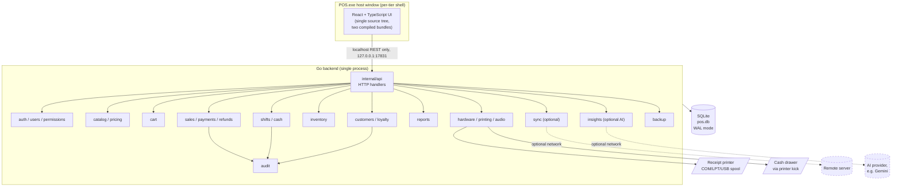
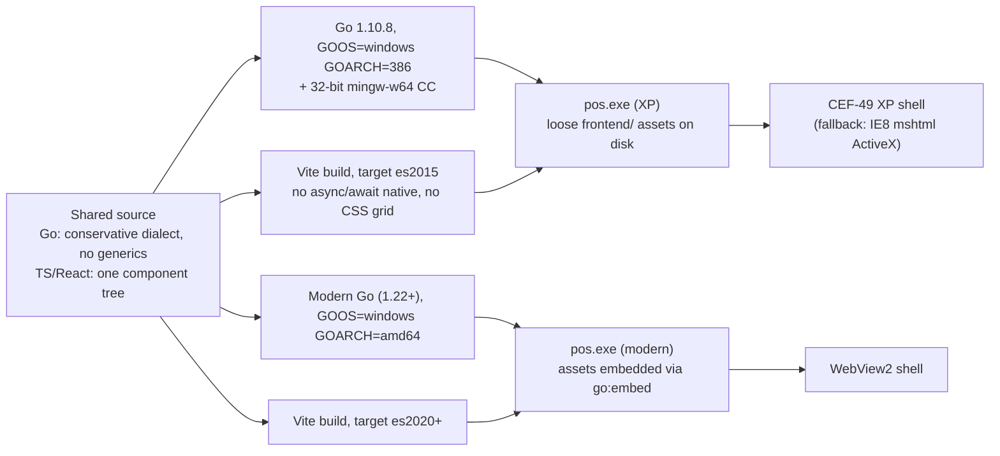
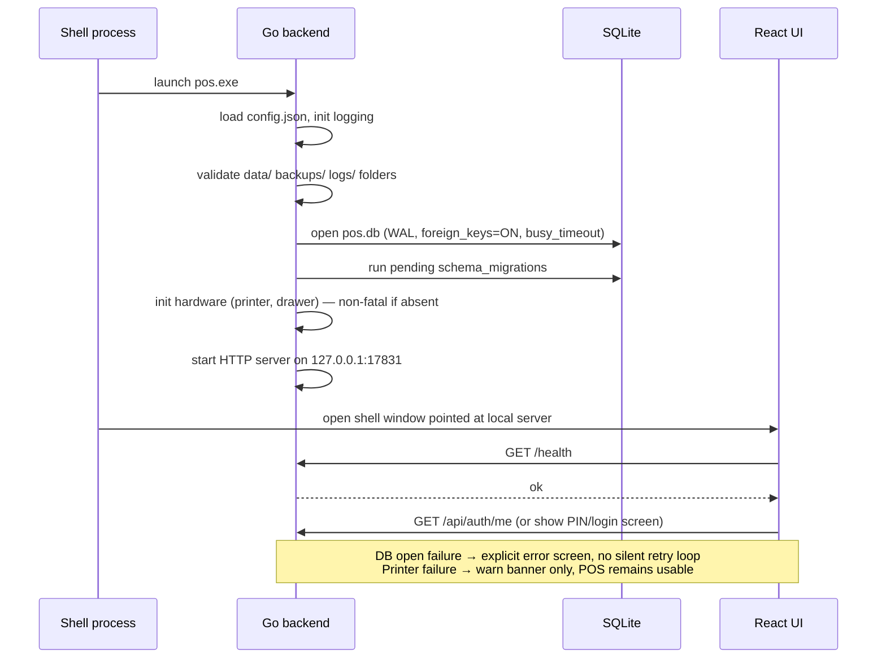
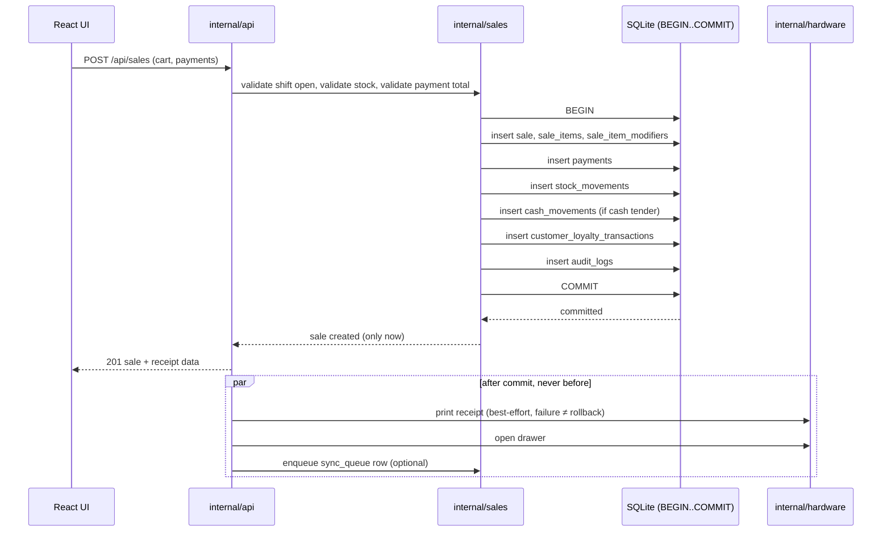

# Proposed Architecture & Repository Structure

**Status:** Phase 0 deliverable, follows `00-xp-compatibility-report.md`. Describes the target architecture and repo layout. Full implementation begins only after the four open risks in that report are validated on a real/virtual Windows XP SP3 environment.

---

## 1. System overview



Core rule carried through every layer: **React is presentation only, Go owns all business/domain logic and hardware access, SQLite is the single source of truth**, and every network-dependent feature is optional and isolated so its absence never blocks a sale.

---

## 2. Two-tier build/runtime model



Both binaries speak the exact same REST contract and read/write the exact same SQLite schema, so a merchant can move a `pos.db` file from an XP-era register to a modern one (or vice versa via the backup/restore flow in §77–78 of the brief) without a migration step beyond the normal `schema_migrations` runner.

---

## 3. Startup sequence (both tiers)



---

## 4. Sale transaction flow (atomicity boundary)



A sale is never shown as successful before the `COMMIT` returns; printer/drawer/sync actions happen strictly after and can fail independently (per §80 of the brief).

---

## 5. Repository tree

```text
Point-of-Sale/
├── README.md
├── LICENSE
├── docs/
│   ├── 00-xp-compatibility-report.md
│   ├── 01-architecture-and-repo-structure.md
│   ├── phase-0-vertical-slice/          # proof artifacts once Phase 0 runs
│   └── adr/                             # architecture decision records, one file per decision
│
├── cmd/
│   └── pos/
│       └── main.go                      # single entrypoint, both build tiers
│
├── internal/
│   ├── api/                             # HTTP handlers, routing, request/response DTOs
│   ├── auth/                            # login, PIN lock/unlock, cashier switch, sessions
│   ├── users/                           # users, roles, permissions, role_permissions
│   ├── catalog/                         # categories, products, barcodes, variants, modifiers
│   ├── pricing/                         # money type, tax rules, discount rules
│   ├── cart/                            # in-memory/staged cart composition before sale commit
│   ├── sales/                           # sale commit transaction, sale_items snapshots
│   ├── payments/                        # payment adapters: cash, card(terminal), transfer, gift card, split
│   ├── customers/                       # customers, addresses, notes
│   ├── loyalty/                         # loyalty ledger engine (earn/redeem/adjust/expire/refund)
│   ├── inventory/                       # stock_movements, inventory_balances, low-stock rules
│   ├── shifts/                          # shift lifecycle, Z-report generation
│   ├── cash/                            # cash_in/out/drop, float adjustments
│   ├── refunds/                         # full/partial/item refunds referencing original sale
│   ├── reports/                         # summary KPIs, top products, payment mix, CSV export
│   ├── hardware/                        # Printer / CashDrawer / BarcodeScanner / Scale / PaymentTerminal interfaces
│   │   ├── printing/                    # ESC/POS builder, RAW spool, COM, LPT implementations
│   │   └── audio_bridge/                # optional native fallback (winmm) behind AudioService contract
│   ├── sync/                            # sync_queue worker (disabled unless remote configured)
│   ├── insights/                        # AIInsightProvider interface + optional Gemini implementation
│   ├── backup/                          # backup, verify, restore
│   ├── config/                          # config.json loading
│   ├── storage/                         # SQLite connection, migrations runner, transaction helpers
│   └── audit/                           # audit_logs writer, used by every domain package
│
├── migrations/
│   ├── 001_initial.sql
│   ├── 002_customers.sql
│   ├── 003_modifiers.sql
│   ├── 004_loyalty.sql
│   └── ...
│
├── frontend/
│   ├── package.json
│   ├── vite.config.ts                   # emits dist/modern and dist/legacy via VITE_TARGET_TIER
│   ├── tsconfig.json
│   ├── tsconfig.legacy.json             # es2015 target, no-async-native flag for CEF-XP tier
│   └── src/
│       ├── app/                         # shell, routing, global layout (sidebar/topbar)
│       ├── components/                  # shared, tier-agnostic UI primitives
│       ├── features/
│       │   ├── auth/
│       │   ├── sell/
│       │   ├── cart/
│       │   ├── checkout/
│       │   ├── orders/
│       │   ├── customers/
│       │   ├── catalog/
│       │   ├── register/
│       │   ├── shifts/
│       │   ├── reports/
│       │   └── settings/
│       ├── services/                    # AudioService, PrintingStatusService, ScannerListener, etc.
│       ├── hooks/
│       ├── i18n/
│       │   ├── es.ts
│       │   ├── en.ts
│       │   └── ar.ts
│       ├── styles/
│       ├── types/
│       ├── utils/
│       └── capabilities.ts              # runtime tier flags (grid vs flex, animation on/off, async support)
│
├── installer/
│   ├── nsis/
│   │   ├── pos-xp.nsi
│   │   └── pos-modern.nsi
│   └── assets/                          # icons, license shown by installer
│
├── build/
│   ├── go-xp-toolchain.md               # pinned Go 1.10.8 + mingw setup notes
│   ├── build-xp.sh
│   └── build-modern.sh
│
├── deploy/                              # example of the on-disk layout described in §90 of the brief
│   └── POS/
│       ├── pos.exe
│       ├── config.json
│       ├── frontend/                    # only populated for the XP artifact
│       ├── data/
│       ├── logs/
│       ├── backups/
│       ├── assets/
│       │   ├── products/
│       │   └── sounds/
│       └── drivers/
│
├── scripts/                             # dev-only helper scripts (seed data, local run)
│
└── test/
    ├── backend/                         # money, tax, discount, split-payment, refund, shift-close unit tests
    ├── db/                              # migration up/down, FK constraint, backup/restore tests
    └── integration/                     # barcode→cart→payment→sale→inventory→loyalty→receipt
```

---

## 6. What is deliberately *not* built yet

Per the brief's own phasing (§96) and the open risks in the compatibility report, nothing beyond this document and the compatibility report is implemented in this change. The next unit of work is **Phase 0's vertical slice**: the smallest possible `pos.exe` that opens SQLite, serves one REST endpoint, and renders one React screen — built and run on both toolchains, and specifically validated against the four open risks listed at the end of `00-xp-compatibility-report.md` on a real or virtual Windows XP SP3 machine.

---

## 7. Recommendation

Proceed to **Phase 0** with a spike whose only goal is answering the four open risks empirically. Do not begin Phase 1 (auth, catalog, cart, cash checkout, SQLite transaction, receipt) until that spike has either confirmed the CEF-XP path or forced a decision to ship the simplified IE8/ES3 fallback UI as the XP experience — because that decision changes the frontend's scope for the legacy tier substantially and should not be discovered mid-Phase-1.
